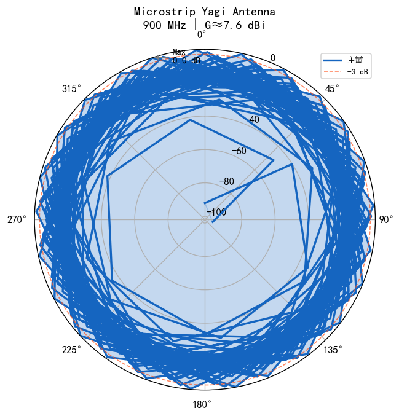

# 📡 微带八木天线设计与分析工具
# Microstrip Yagi-Uda Antenna Design & Analysis Toolkit

[](https://www.python.org/)
[](https://streamlit.io/)
[](LICENSE)

> 面向 **GSM-R 铁路移动通信**场景的微带八木天线参数计算与可视化工具。
> 基于 Python + Streamlit 构建，支持交互式设计、方向图生成、S11 分析等核心功能。



---

## ✨ 功能特性

| 模块 | 说明 |
|------|------|
| 🧮 **参数计算** | 自动计算激励单元、反射器、引向器的几何尺寸 |
| 📊 **方向图绘制** | 极坐标 + 直角坐标系，E/H 面双视图 |
| 📈 **S11 分析** | 回波损耗曲线生成与工作带宽估算 |
| 🌐 **Web 交互界面** | 基于 Streamlit 的可视化操作面板 |
| 🔄 **多频点对比** | 支持多频率方向图并排对比 |

## 🚀 快速开始

### 环境要求

- Python 3.10+
- pip / conda

### 安装依赖

```bash
pip install -r requirements.txt
```

### 运行 Web 应用

```bash
streamlit run app.py
```

浏览器将自动打开 `http://localhost:8501`。

### 命令行使用

```python
from src.antenna_calculator import calculate_yagi_antenna

# 设计一个 900MHz 微带八木天线（3个引向器）
design = calculate_yagi_antenna(frequency_mhz=900, num_directors=3)
print(design.summary())

# 输出：
# ====================================================
#   微带八木天线设计方案 | f = 900.0 MHz
# ==================================================== 
#   波长信息:
#     自由空间波长 λ₀ = 333.1 mm
#     基板波长      λg ≈ 166.4 mm
#
#   振子参数:
#     ┌─ 激励单元: L=156.56 mm, W=6.66 mm
#     ├─ 反 射 器: L=173.21 mm, d=73.28 mm
#     ├─ 引向器 1: L=146.57 mm, d=53.30 mm
#     ├─ 引向器 2: L=142.60 mm, d=79.94 mm
#     └─ 引向器 3: L=138.63 mm, d=106.59 mm
#
#   性能预估:
#     增益 G ≈ 7.6 dBi
#     前后比 F/B ≈ 12.5 dB
# ====================================================
```

## 📁 项目结构

```
microstrip-yagi-toolkit/
├── app.py                      # Streamlit Web 主程序
├── requirements.txt            # Python 依赖清单
├── README.md                   # 项目文档
├── src/
│   ├── __init__.py
│   ├── antenna_calculator.py   # 核心：天线参数计算引擎
│   └── radiation_pattern.py    # 可视化：方向图与 S11 绘制
├── data/                       # 示例数据目录
└── assets/                     # 图片等静态资源
```

## 🔬 技术原理

### 八木天线工作原理

微带八木天线由三部分组成：

1. **驱动元件 (Driven Element)** — 半波偶极子，接收馈电能量
2. **反射器 (Reflector)** — 位于驱动元件后方，抑制后向辐射
3. **引向器 (Director)** — 多个寄生振子阵列，引导前向辐射增强

```
          ══════════════════════ → 辐射方向 (主瓣)
          
    [D3]  [D2]  [D1]  [Driven]   [Reflector]
    引向器3 引向器2 引向器1 激励单元   反射器
    
    L↓递减           λ₀/2谐振    L↑5~10%
    
    ─────────────────────────────────────→ 介质基板
```

### 关键公式

| 参数 | 公式 | 说明 |
|------|------|------|
| 自由空间波长 | `λ₀ = c / f` | c 为光速，f 为工作频率 |
| 基板有效波长 | `λg = λ₀ / √εeff` | εeff 为有效介电常数 |
| 增益估算 | `G ≈ 4.5 + 2·log₁₀(N)` | N 为总振子数 |
| 半功率波束宽度 | `HPBW ≈ 55°/√(L/λ)` | L 为天线长度 |

### 典型设计参数 (GSM-R 900MHz)

| 元件 | 长度 | 间距 |
|------|------|------|
| 驱动单元 | ~156 mm (≈0.47λ) | 参考点 |
| 反射器 | ~173 mm (≈0.52λ) | 后 73 mm |
| 引向器 D1 | ~146 mm (≈0.44λ) | 前 53 mm |
| 引向器 D2 | ~143 mm (≈0.43λ) | 前 80 mm |
| 引向器 D3 | ~139 mm (≈0.42λ) | 前 107 mm |

## 🛠️ 开发计划

- [x] 核心参数计算模块
- [x] 方向图可视化（极坐标 + 直角坐标）
- [x] S11 回波损耗曲线
- [x] Streamlit Web 交互界面
- [ ] HFSS/CST 脚本自动生成
- [ ] 参数优化算法（遗传/粒子群）
- [ ] 多层堆叠天线支持

## 📝 使用示例

### 示例 1：快速计算

```bash
cd src && python antenna_calculator.py
```

### 示例 2：自定义基板材料

```python
from src.antenna_calculator import Substrate, calculate_yagi_antenna

rogers = Substrate(epsilon_r=3.48, thickness=0.8, loss_tangent=0.003)
design = calculate_yagi_antenna(
    frequency_mhz=900,
    num_directors=4,
    substrate=rogers,
)
print(f"预估增益: {design.estimated_gain} dBi")
```

### 示例 3：批量频点扫描

```python
import numpy as np
from src.antenna_calculator import calculate_yagi_antenna

freqs = np.arange(850, 935, 5)
for f in freqs:
    d = calculate_yagi_antenna(frequency_mhz=f)
    print(f"{f:>4} MHz → G={d.estimated_gain:.1f} dBi")
```

## 📄 License

MIT License - 详见 [LICENSE](LICENSE) 文件


---

⭐ 如果这个工具对你有帮助，欢迎给个 Star！
